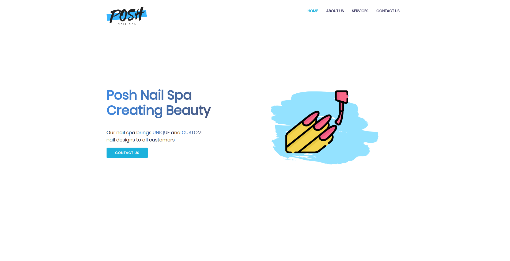

## Posh Nail Spa - Business Website

### Installation and setup
1. Install and use the correct version of Node using NVM
   nvm install
2. Install dependencies
   npm install
3. Start the development server
   npm run dev
### Build and run for production
1. Generate a full static production build
   npm run build
2. Preview the site as it will appear when deployed
   npm run start